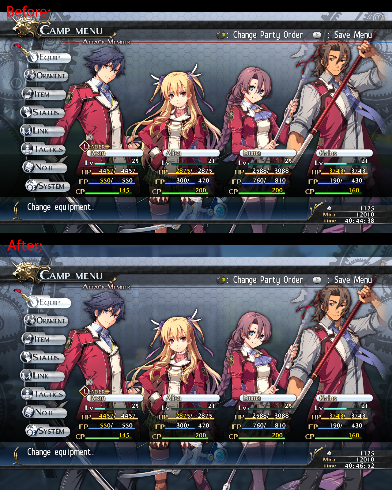
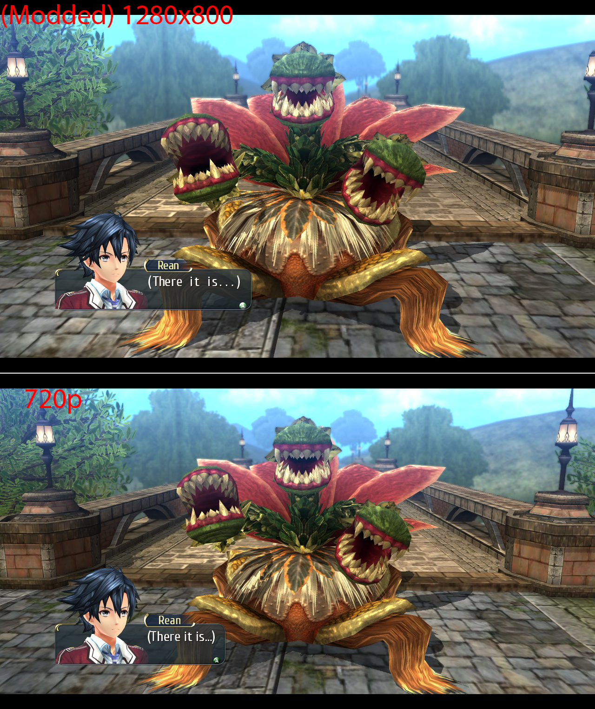
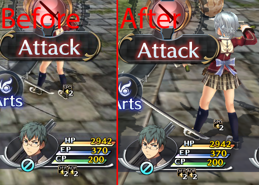
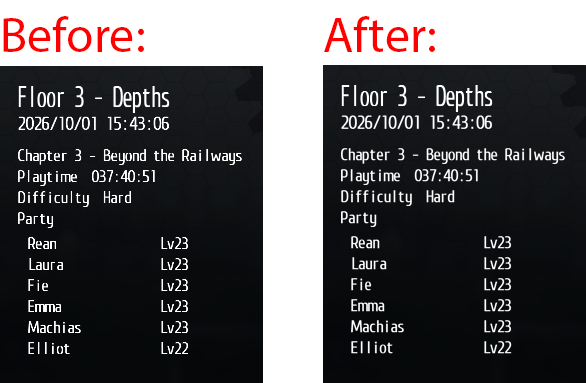
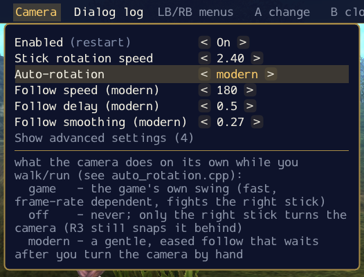
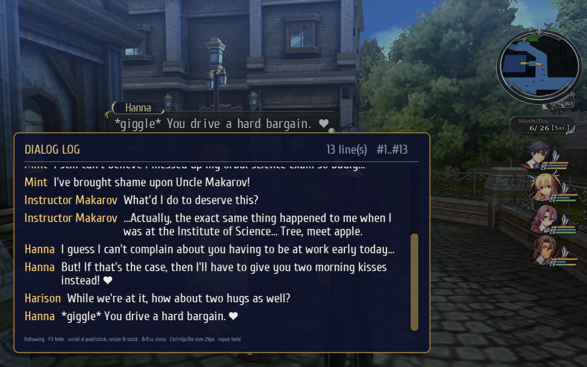
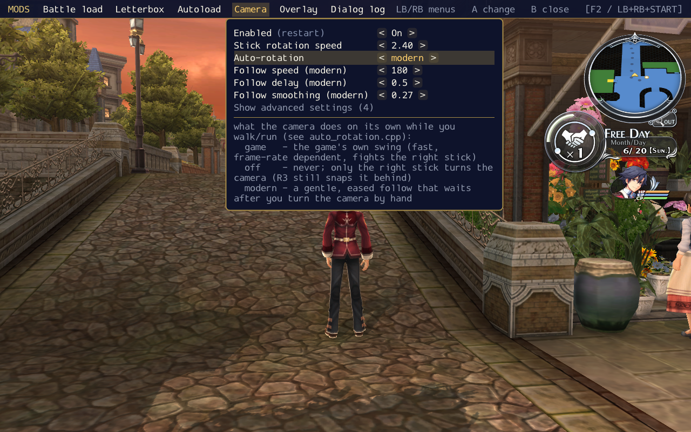
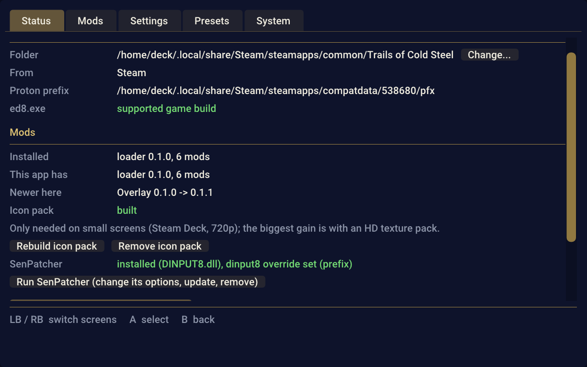

# Another Trails Modding Toolkit

A toolkit for modding Trails of Cold Steel I, providing enhancements and quality-of-life improvements. Other Trails games may be supported in the future - when I'll get to them. :)

**DISCLAIMER:** This toolkit is built with heavy use of AI. I do have pre-AI experience with game modding, but almost all code here is generated or assisted by AI. If that is a concern for you - fair enough, consider yourself noted.

## Features

- [Improved Steam Deck screen support](#improved-steam-deck-screen-support) - native 1280x800 resolution and rendering tweaks
- [Improved camera behavior](#improved-camera) - configurable rotation speed and smoothing
- [Load game from anywhere](#load-game-from-anywhere) - hotkey to load game from dialog or battle (LB+RB+Back by default)
- [Dialog log window](#dialog-log-window) - view logs of all dialogs by pressing hotkey (LS by default)
- [Auto load last save on game start](#auto-load-last-save-on-game-start) - automatically load the last save on game start
- [In-game configuration overlay](#in-game-configuration-overlay) - configure all mods in-game even via controller (LS+RS by default)
- [ATMT Manager](#atmt-manager) - one app to install and configure SenPatcher on Deck or Windows and the mods mentioned above, configure and update them


# Installation

1. Download ATMT Manager from Releases: `.exe` for Windows, `.AppImage` for Steam Deck / Linux (run it in Desktop Mode).
2. Run it. It finds the game (Steam, GOG, Heroic, Lutris), or pick the folder with `ed8.exe`.
3. Press **Install everything**. It applies the PC or Steam Deck preset to match your system.

Mods, settings and updates are managed in the same app. To uninstall, use **Remove everything**.

**SenPatcher**: on the Status screen, **Run SenPatcher** downloads its latest release and opens it: press **Patch game** for Trails of Cold Steel there, then close it. On Steam Deck / Linux (SenPatcher has no Linux release) its window runs through the game's Proton, and the manager sets the `dinput8` dll override in the game's Proton prefix first, so no launch options are needed; there this works for the Steam version of the game.

## Manual installation

1. Download `payload-<version>.tar.gz` from Releases and unpack it.
2. In the game folder (the one with `ed8.exe`), rename `GFSDK_SSAO_D3D11.win32.dll` to `GFSDK_SSAO_D3D11.win32.orig.dll`.
3. Copy `GFSDK_SSAO_D3D11.win32.dll` and the `atmt_mods` folder from the archive into the game folder.
4. On PC, move `atmt_mods\deckscreen.dll` into `atmt_mods\disabled\` (it is for the Steam Deck screen).

To uninstall, delete `GFSDK_SSAO_D3D11.win32.dll`, `atmt_mods` and the `atmt_*` files, then rename `GFSDK_SSAO_D3D11.win32.orig.dll` back.


---------

# Improved Steam Deck screen support

Set of fixes to make game look better on steamdeck screen.

## Native resolution & UI
Set of improvements to add support for native SteamDeck resolution (1280x800).
Game originally support only 16:9 aspect ratio. You can force other resolutions in config, but UI does not work with it correctly.
This mod will force 1280x800 resolution without sacrificing 10% of vertical space to black bars.



> NOTE: Since screen proportions are changed, camera may not produce exact framing as intended by the original game. I think this is a reasonable trade-off, but here is an example of same frame with the new aspect ratio.



## Crisp small icons for small screens (SenPatcher required)

When game downscales small UI icons with non-integer scaling factors, they become pixelated. ATMT Manager able to override these icons with pre-scaled to size suitable for smaller screens.

This will require [SenPatcher](https://github.com/AdmiralCurtiss/SenPatcher) to replace game assets. ATMT Manager can do it for you automatically.

> DO NOT install it on big screens, otherwise icons would become blurry.

Note that differences may not be that noticeable on large screens, but it does improve clarity quite a bit on read Deck display:



## Small text improvements
Render small text with shaders to avoid pixelization.



# Improved Camera

## Configurable RStick rotation speed

Add configuration to allow make camera rotation faster when using RStick.

## Improved camera behavior

Original game's camera rotation is tied to framerate, so for larger FPS it rotates too sharply.
Added option to change camera behavior to be more modern - with configurable smoothing. When enabled, it should just feel natural, like in modern games.



# Load game from anywhere

Add hotkey that allows to load game directly from dialog or battle (LB+RB+Back by default).

# Dialog log window

Adds window similar to the one in Crossbell arc - you can see logs of all dialogs by pressing hotkey (LS by default).



# Auto load last save on game start

Adds ability to autoload last save on game start - similar to how Crossbell arc games did it. By default on every start; it can be set to only look for the "-al" flag (Steam launch options), or turned off.

# In-game configuration overlay

All mods are configurable using in-game overlay even via controller (LS+RS by default).



# ATMT Manager

Installation and configuration manager.

- Can download and installs and configure SenPatcher
- Support auto-updating
- Provide GUI for mods configuration
- SteamDeck friendly: native linux build, works well with the controller, can add itself to Steam to use in gaming mode
- Easy to uninstall anything and everything



---------

# Supported game

The mods are written for **The Legend of Heroes: Trails of Cold Steel** (PC, `ed8.exe`, Steam and GOG, 32-bit).
Every address a mod hooks is compared with the bytes of the supported exe first
([supported_exe.txt](manager/payload/supported_exe.txt)); on another build the mod logs an error and installs
nothing instead of crashing. [SenPatcher](https://github.com/AdmiralCurtiss/SenPatcher) 1.x coexists with the
toolkit (it is also where the icon pack goes).

Nothing here modifies a game file: the loader is a proxy for `GFSDK_SSAO_D3D11.win32.dll` (the game's own copy is
only renamed). Hook-style mods can trip antivirus heuristics; if a scanner objects to a built file, add an
exclusion for the game folder and for this repository's `build/` and `dist/`.

# Building from source

Windows, with [LLVM-MinGW](https://github.com/mstorsjo/llvm-mingw) (`winget install MartinStorsjo.LLVM-MinGW.UCRT`),
CMake and git:

```powershell
powershell -ExecutionPolicy Bypass -File tools\build.ps1            # loader + mods + tests  -> dist\game
powershell -ExecutionPolicy Bypass -File tools\build_manager.ps1    # ATMT Manager + payload -> dist\
```

Everything usable ends up in `dist/`; `build/` only holds intermediates. Details: [docs/BUILD.md](docs/BUILD.md).

# Repository layout

| path | what |
| --- | --- |
| `loader/` | the game-agnostic hook host: proxy dll, mod loading, hook service, settings registry |
| `mods/` | one directory per mod (`_template/` to start a new one) |
| `shared/` | the loader/mod contract (`mod_api.h`) and small shared headers |
| `manager/` | ATMT Manager, the installer and configurator (SDL2 + Dear ImGui, Windows and Linux) |
| `tests/` | offline test harnesses (no game needed) |
| `tools/` | build, deploy and release scripts; small reverse-engineering helpers |
| `ghidra/` | headless Ghidra wrappers and scripts for studying `ed8.exe` |
| `docs/` | developer documentation, starting at [docs/README.md](docs/README.md) |

# License

MIT
